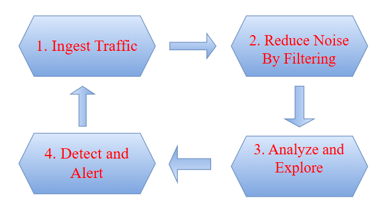

# Network-Traffic-Analysis
Network traffic analysis is the process of monitoring and inspecting network traffic patterns. By identifying anomalies or suspicious behavior, network traffic analysis can help network security and operations teams detect threats. Network traffic analysis can also be useful for troubleshooting performance issues, such as high rates of packet loss or high network latency.
Likewise, malicious network activity, such as port scanning or Denial-of-Service (DoS) attacks, often creates unusual traffic patterns. By detecting anomalies, organizations can identify potential security risks, and then block them before a breach occurs.

## WorkFLow

  

   
  

## TCP Three-Way Handshake

## TCP Session Teardown

